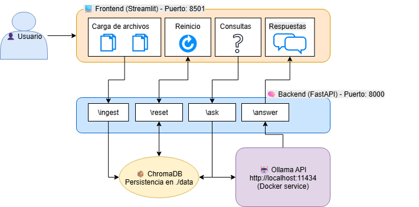

# 🧠 Sistema Conversacional

Este proyecto implementa un **asistente conversacional** capaz de responder preguntas en lenguaje natural a partir de documentos propios cargados por el usuario.  

---

## 🚀 Instrucciones de despliegue

### 1. Requisitos previos
- **OLLAMA** (https://ollama.com/), **Docker** y **Docker Compose** instalados.  
(Importante tener instalados en la computadora local)
- **Recursos mínimos recomendados**:
  - CPU: 2 núcleos
  - RAM: 4 GB
  - Espacio en disco: 2 GB libres

### 2. Clonar repositorio
```bash
git https://github.com/fabian-sepulveda/CatchAI-Desaf-o-T-cnico.git
cd CatchAI-Desaf-o-T-cnico.
```

### 3. Levantar entorno
Ejecutar el siguiente comando:

```bash
docker-compose up --build
```

Esto levantará los servicios en paralelo:
- **Backend (FastAPI)** → `http://localhost:8000`
- **Frontend (Streamlit)** → `http://localhost:8501`
- **Chroma (DB vectorial)** → embebida en backend

### 4. Flujo de uso
1. Abrir navegador en `http://localhost:8501`  
2. Subir documentos (PDFs)  
3. Escribir una pregunta en lenguaje natural  
4. Recibir respuesta con contexto y citas a los documentos cargados  

---

## 🏗️ Arquitectura del sistema



### Componentes principales
- **Frontend (React)** → interfaz web para subir documentos y chatear.  
- **Backend (FastAPI)** → procesa documentos, genera embeddings, consulta al LLM.  
- **ChromaDB** → almacena embeddings y chunks de documentos.  
- **LLM (Ollama u OpenAI)** → genera respuestas contextualizadas.  

---

## ⚙️ Elecciones técnicas

- **FastAPI** → framework Python rápido y asíncrono, ideal para exponer APIs REST.  
- **ChromaDB** → base vectorial embebida, sin necesidad de dependencias externas, ideal para prototipos.  
- **Streamlit** → UI interactiva y flexible, facilita interfaz estilo chatbot, permitiendo la subida de archivos y procesamiento de estos.
- **Docker Compose** → despliegue reproducible, desacopla frontend, backend y DB.  
- **LLM (Ollama u OpenAI)** → permite trabajar en local (offline con Ollama) o escalar en la nube (OpenAI). En particular se emplea Ollama, pero se dejan los lineamientos para escalar a OpenAI.

---

## 💬 Flujo conversacional

1. **Carga de documentos**:  
   - PDFs son leídos y divididos en *chunks* de texto.  
   - Cada chunk se transforma en vector (embedding) y se guarda en Chroma.  

2. **Pregunta del usuario**:  
   - Se genera un embedding para la pregunta.  
   - Se buscan los *chunks* más relevantes en Chroma (similaridad coseno).  

3. **Construcción de prompt**:  
   - El backend arma un prompt con el contexto relevante.  
   - Se ajusta la instrucción para exigir respuestas claras y citadas.  

4. **Generación de respuesta**:  
   - El LLM produce una respuesta con 2–4 citas de los documentos fuente.  

5. **Devolución**:  
   - La respuesta se envía al frontend junto con citas (ej: documento y páginas).  

---

## 📖 Ejemplo de uso

### Pregunta 1
```
¿Cuantos documentos de he entregado?
```

### Respuesta 1 esperada
```
Te he entregado un total de X documentos. Aquí tienes una lista de los mismos con sus respectivas páginas

(Listado)
```

### Pregunta 2
```
Resume los documentos
```

### Respuesta 1 esperada
```
Resumen de los documentos proporcionados:

(Listado con resumenes de cada documento)

```


---

## ⚠️ Limitaciones actuales

- **Entrada**: solo soporta PDF.  
- **Escalabilidad**: corpus limitado, no apto para millones de documentos.  
- **Tiempo de respuesta**: timeout actual = 120s. Posterior entregara un timeout 
- **Control de acceso**: sin autenticación de usuarios ni permisos diferenciados.  
- **Naturalidad de respuestas**: depende del prompt, algunas respuestas pueden sonar rígidas.  
- **Procesamiento paralelo**: sin balanceador de carga ni workers distribuidos.  
- **Errores de identificación de documentos**: En ocasiones el sistema puede confundir los documentos. (ej: Se entregan 5 archivos, y en la consulta de "Nombra los archivos", menciona 4.). Ante este escenario se recomienda reiniciar la ejecución desde consola.
---

## 🚧 Roadmap (mejoras futuras)

- [ ] Ampliar soporte a `.docx`, `.txt`, `.csv`.  
- [ ] Integrar servicios de OpenAI.
- [ ] Integrar almacenamiento persistente (ej. PostgreSQL + pgvector).  
- [ ] Mejorar el frontend: vista previa de documentos cargados.
- [ ] Optimizar prompt para respuestas más naturales y explicativas.  
- [ ] Añadir monitoreo (logs de consultas, métricas de calidad).  

---


## 📌 Créditos

- **Tecnologías:** FastAPI, Streamlit, Docker, ChromaDB, Ollama/OpenAI  

